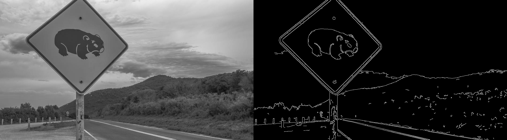

# ZHAN Shi 48323626
# Q1
## Detect sign in one image

1. Find my favorite image within folder which is Image19. And using canny edge detection to find the edge. Canny edge detection include noise reduction using Gaussian filter and edge detection by vertical, horizontal gradient.
Here is result:


2. Then detect the largest contours using cv2.findContours
Here is result:

<br>Here is code:<br>
```
import cv2
import numpy as np
from screeninfo import get_monitors

path="StreetSigns\Image19.jpg"

# detect edge
img = cv2.imread(path)
img_gray = cv2.cvtColor(img, cv2.COLOR_BGR2GRAY)
edges = cv2.Canny(img,180,200)

# find the largest contours
contours, _ = cv2.findContours(edges, cv2.RETR_LIST, cv2.CHAIN_APPROX_SIMPLE)
contours = sorted(contours, key=cv2.contourArea, reverse=True)
cv2.drawContours(img, [contours[0]], -1, (0, 0, 255), 5)

# show images
get_monitors()
image_show=np.hstack((img_gray,edges))
cv2.imshow("image_show", image_show)
cv2.imshow("img_contours", img)

key = cv2.waitKey(0)
```

## Detect sign in other images

1. Using the exist method to detect all the other images
<br>Here is result:<br>

Nearly half of images have right sign while others can not. It is apparently that one method can not detect all. So we classify the errors to three types, **multi-signs**, **detect within signs**, and **cannot detect**. we will solve them one by one, and explain the reason why the detect method fail.

1. multi-signs error
After fine tune the Canny parameters and increase contours' numbers, we have better result. But in the below result, the image on the left still can not detect well. we suppose the sign has similar color as sky and the background has too much noise which generate many edges.
<br>Here is output image:<br>

<br>Here is code:<br>
```
edges = cv2.Canny(img, 200, 300)

# find the largest contours
contours, _ = cv2.findContours(edges, cv2.RETR_LIST, cv2.CHAIN_APPROX_SIMPLE)
contours = sorted(contours, key=cv2.contourArea, reverse=True)
for contour in contours[:7]:
    cv2.drawContours(img, [contour], -1, (0, 0, 255), 5)
```

3. detect within signs error
we find that in this kind of image, the edge is not continue in several points, like the image blow. So findContours can not work correctly even though the detected edge are generally clear.
<br>Here is output image:<br>


So we introduce cv2.dilate, which can eliminate the gaps between edges. "image6.jpg" can have better result as below.
<br>Here is output image:<br>

<br>Here is code:<br>
```
dilated_image = cv2.dilate(img, np.ones((5, 5), np.uint8), iterations=1)

edges = cv2.Canny(dilated_image, 100, 120)

# find the largest contours
contours, _ = cv2.findContours(edges, cv2.RETR_LIST, cv2.CHAIN_APPROX_SIMPLE)
contours = sorted(contours, key=cv2.contourArea, reverse=True)
for contour in contours[:5]:
    cv2.drawContours(img, [contour], -1, (0, 0, 255), 5)
```
4. cannot detect error
The images blew all can not detect at all. But each of them has different reason. The first one on the left, sign is small and the trees have a bigger gradient compare with sky. In the second one, the white sign on the road becomes the largest contour area. The third one has edge discontinue problem which is more similar to the lass group, and only part of sign edge is detected. The forth one's upper edge is effected by snow, which means it is not clear edge.

<br>we add another GaussianBlur, which means erase more noise. The third one has better result as below.

<br>Here is code:<br>
```
img_gray = cv2.cvtColor(img, cv2.COLOR_BGR2GRAY)
# add another Gaussian filter
img_blur = cv2.GaussianBlur(img, (5, 5), 0)
edges = cv2.Canny(img_blur, 100, 180)

# find the largest contours
contours, _ = cv2.findContours(edges, cv2.RETR_LIST, cv2.CHAIN_APPROX_SIMPLE)
contours = sorted(contours, key=cv2.contourArea, reverse=True)
for contour in contours[:3]:
    cv2.drawContours(img, [contour], -1, (0, 0, 255), 5)
```

# Q2
1. Create a template and match the template
Because the position of the power cable on the pantograph don't change much in the video. So we want to locate a more precious area for detection or other operation. Then we create a template and use the template to match the same area in other frames through "cv2.matchTemplate".
<br>Here is template:<br>

<br>Here is code:<br>
```
# Creat template
cap = cv2.VideoCapture("Panto2024.mp4")
cap.set(cv2.CAP_PROP_POS_FRAMES, 120)
ret, frame = cap.read()
gray_frame = cv2.cvtColor(frame, cv2.COLOR_BGR2GRAY)
_, binary_frame = cv2.threshold(gray_frame, 83, 255, cv2.THRESH_BINARY)
template = binary_frame[400:570, 640:1185]
```
```
# match template
res = cv2.matchTemplate(binary_frame, template, cv2.TM_CCOEFF)
min_val, max_val, min_loc, max_loc = cv2.minMaxLoc(res)
width, height = 545, 270
x_start, y_start = max_loc[0], max_loc[1]
x_end, y_end = x_start + width, y_start + height
cv2.rectangle(frame, max_loc, (max_loc[0] + width, max_loc[1] + height), 255, 2)
```

2. Apply Hough method in selected area
We am apply Hough method trying to find the lines in the frame through "cv2.HoughLines".
<br>Here is one output frame:<br>

<br>Here is code:<br>
```
edges = cv2.Canny(img_blur, 400, 550)
lines = cv2.HoughLines(edges, 1, np.pi / 180, 100)
if lines.any():
    for line in lines:
        rho, theta = line[0]
        a = np.cos(theta)
        b = np.sin(theta)
        x0 = a * rho+x_start
        y0 = b * rho+y_start
        x1 = int(x0 + 2000 * (-b))
        y1 = int(y0 + 2000 * (a))
        x2 = int(x0 - 2000 * (-b))
        y2 = int(y0 - 2000 * (a))
        cv2.line(frame, (x1, y1), (x2, y2), (0, 0, 255), 2)
```
After that, we have meet several problems.

- How to find the intersections?
- How to classify suspension cable and the power cable?
- Suspension cable does not detected in many frames.
- Too many lines, one vertical and one horizontal is enough.

3. Detect cable and pantograph separately
- Detect cable
The upper area is a better place to find the cable, So we create another area which is detecting cable only. It seems much better in cable detection.
<br>Here is one output frame:<br>

- Detect pantograph
To find the pantograph, we filter the horizontal line, and pick the top one.
<br>Here is one output frame:<br>

<br>Here is code:<br>
```
lines = cv2.HoughLines(edges, 1, np.pi / 180, 80)
if lines.any():
    lines= list(filter(lambda line: line[0][0]<100 and line[0][0]>50, lines))
    lines= list(filter(lambda line: line[0][1]>0, lines))
    line= min(lines[:2],key=lambda line: line[0][0]/np.sin(line[0][1]))
    rho, theta =line[0]
    a = np.cos(theta)
    b = np.sin(theta)
    x0 = a * rho+x_start
    y0 = b * rho+y_start
    x1 = int(x0 + 2000 * (-b))
    y1 = int(y0 + 2000 * (a))
    x2 = int(x0 - 2000 * (-b))
    y2 = int(y0 - 2000 * (a))

    cv2.line(frame, (x1, y1), (x2, y2), (0, 0, 255), 2)
```
Here is the output video link:
[https://drive.google.com/file/d/1LvBUPdeVGIhiyU4p-hgo6Vf2gd3Euyvc/view?usp=sharing](https://drive.google.com/file/d/1LvBUPdeVGIhiyU4p-hgo6Vf2gd3Euyvc/view?usp=sharing)

4. Classify suspension cable and the power cable
- Filt rho and theta of lines to classify cable. Because suspension cable has fixed region of rho and theta.
- Limit derivative of rho. Because rho of cable will not change quickly, it changes smoothly.Any detected line which has large derivative of rho is wrong detect.
<br>Here is one output frame:<br>

Here is code snippet of the blow two filters:
```
lines = cv2.HoughLines(edges, 1, np.pi / 180, 100)
if lines.any():
    if last_rho<1000:     
        lines_smooth= list(filter(lambda line: line[0][0]<last_rho+50 and line[0][0]>last_rho-50, lines))
        if len(lines_smooth)!=0:
            lines=lines_smooth
    lines_filt= list(filter(lambda line: line[0][0]<-50 and line[0][1]>2.0, lines))
    if len(lines_filt)!=0:
        lines=lines_filt
    line= min(lines[:5],key=lambda line: -line[0][0])
```
5. Final result
<br>Here is one output frame:<br>


Here is the output video link:
[https://drive.google.com/file/d/1u2UZowAeIh_85Yp3C4fytGPp57Ra_9vF/view?usp=sharing](https://drive.google.com/file/d/1u2UZowAeIh_85Yp3C4fytGPp57Ra_9vF/view?usp=sharing)

6. Challenges lighting, daynight vision, rain, clouds etc
For day night vision or brightness changing situation, cable or pantograph detection can be more different, because they has less contrast. So we may need to fine tune Canny and HoughLines parameters, make them more sensitive. These parameters need to adjust according to the brightness. Lighting will bring too much contrast, and it happens quickly. So we may need to reduce the parameters to make the detection more insensitive. Clouds may not be a big problems, because they are not lines, HoughLines normally will not detect them. Rain may bring more noise, we may need to add a more effective Gaussian filter to eliminate them.

# Q3
1. detect broomstick line
- Using Canny detect edges and HoughLines detect lines.But there are too many lines.
<br>Here is output image:<br>


- Filter line and choose one
Through the last image, find that these line are in groups, ans echo group has similar rho and theta of lines. So filter the rho and theta, and choose the first one.
<br>Here is output image:<br>


2. detect white line
The white line is relatively small. So cut out the right part of image, we am using pixels after 300 on x-axis. Then using the same method as broomstick line detection.
<br>Here is output image:<br>


3. detect wheels
Use HoughCircles to detect the circles. And set the maxRadius to 30 to filter other circles.
<br>Here is output image:<br>


# Q4
## a
Cardinality is (256 * 256 * 256) ^ (256 * 256). First 3 numbers are for RGB colors, last 2 of them are coordinates. RGB has 3 channels, each of them has 256 values. So the Cardinality of color are multiply of channels. Then each pixel has its own color. So we need to power them.
## b
Dimensionality is (256 * 256) * 3. First 2 represent coordinates, 3 is dimensionality for colors. Each dimension needs 8 bits. Because with these information, a image can show.


# Appendix
## Q2 code
```
import numpy as np
import cv2
from screeninfo import get_monitors

get_monitors()
# Creat template
cap = cv2.VideoCapture("Panto2024.mp4")
cap.set(cv2.CAP_PROP_POS_FRAMES, 120)
ret, frame = cap.read()
gray_frame = cv2.cvtColor(frame, cv2.COLOR_BGR2GRAY)
_, binary_frame = cv2.threshold(gray_frame, 83, 255, cv2.THRESH_BINARY)
template_cable = binary_frame[0:770, 640:1185]
template_pantograph = binary_frame[400:570, 640:1185]

total_frames = int(cap.get(cv2.CAP_PROP_FRAME_COUNT))
cap.set(cv2.CAP_PROP_POS_FRAMES, 0)
count=0
last_rho=2000
while cap.isOpened():
    count+=1
    ret, frame = cap.read()
    if not ret:
        break

    gray_frame = cv2.cvtColor(frame, cv2.COLOR_BGR2GRAY)
    _, binary_frame = cv2.threshold(gray_frame, 83, 255, cv2.THRESH_BINARY)

    # detect cable in fix rectangle
    width, height = 545, 370
    x_start, y_start = 640, 0
    x_end, y_end = x_start + width, y_start + height
    cv2.rectangle(frame, (x_start,y_start), (x_start + width, y_start + height), (255,255,0), 2)
    sub_image = binary_frame[y_start:y_end, x_start:x_end]
    img_blur = cv2.GaussianBlur(sub_image, (5, 5), 0)
    edges = cv2.Canny(img_blur, 400, 550)
    lines = cv2.HoughLines(edges, 1, np.pi / 180, 100)
    if lines.any():
        if last_rho<1000:     
            lines_smooth= list(filter(lambda line: line[0][0]<last_rho+50 and line[0][0]>last_rho-50, lines))
            if len(lines_smooth)!=0:
                lines=lines_smooth
        lines_filt= list(filter(lambda line: line[0][0]<-50 and line[0][1]>2.0, lines))
        if len(lines_filt)!=0:
            lines=lines_filt
        line= min(lines[:5],key=lambda line: -line[0][0])
        rho, theta = line[0]
        if last_rho<1000:  
            if len(lines_smooth)!=0:
                last_rho=rho
        a = np.cos(theta)
        b = np.sin(theta)
        x0 = a * rho+x_start
        y0 = b * rho+y_start
        rho1, theta1 =x_start*np.cos(theta)+rho,theta
        x1 = int(x0 + 2000 * (-b))
        y1 = int(y0 + 2000 * (a))
        x2 = int(x0 - 2000 * (-b))
        y2 = int(y0 - 2000 * (a))
        cv2.line(frame, (x1, y1), (x2, y2), (255, 0, 255), 2)

    # match template pantograph
    width, height = 545, 270
    res = cv2.matchTemplate(binary_frame, template_pantograph, cv2.TM_CCOEFF)
    min_val, max_val, min_loc, max_loc = cv2.minMaxLoc(res)
    x_start, y_start = max_loc[0], max_loc[1]
    x_end, y_end = x_start + width, y_start + height
    cv2.rectangle(frame, max_loc, (max_loc[0] + width, max_loc[1] + height), 255, 2)
    sub_image = binary_frame[y_start:y_end, x_start:x_end]
    img_blur = cv2.GaussianBlur(sub_image, (5, 5), 0)
    edges = cv2.Canny(img_blur, 400, 550)
    lines = cv2.HoughLines(edges, 1, np.pi / 180, 80)
    if lines.any():
        lines= list(filter(lambda line: line[0][0]<100 and line[0][0]>50, lines))
        lines= list(filter(lambda line: line[0][1]>0, lines))
        line= min(lines[:2],key=lambda line: line[0][0]/np.sin(line[0][1]))
        rho, theta =line[0]
        a = np.cos(theta)
        b = np.sin(theta)
        x0 = a * rho+x_start
        y0 = b * rho+y_start
        rho2, theta2 =x_start*np.cos(theta)+y_start*np.sin(theta)+rho,theta
        x1 = int(x0 + 2000 * (-b))
        y1 = int(y0 + 2000 * (a))
        x2 = int(x0 - 2000 * (-b))
        y2 = int(y0 - 2000 * (a))
        cv2.line(frame, (x1, y1), (x2, y2), (0, 0, 255), 2)

    # Draw intersections 
    A = np.array([
        [np.cos(theta1), np.sin(theta1)],
        [np.cos(theta2), np.sin(theta2)]
    ])
    b = np.array([rho1, rho2])
    x, y = np.linalg.solve(A, b)
    cv2.circle(frame, (int(x), int(y)), 0, (255, 255, 255), thickness=30, lineType=cv2.LINE_8, shift=0)


    cv2.imshow("img_blur", frame)
    key = cv2.waitKey(1)
    if key == ord("q") :
        continue
    if key == ord("q") or key == 27:
        break
```

## Q3 code
```
import cv2
import numpy as np
from screeninfo import get_monitors

path = "MrBean2024.jpg"
get_monitors()

# detect edge
img = cv2.imread(path)
img_gray = cv2.cvtColor(img, cv2.COLOR_BGR2GRAY)
edges = cv2.Canny(img_gray, 180, 300)
lines = cv2.HoughLines(edges, 1, np.pi / 180, 100)
lines_filt = list(filter(lambda line: line[0][0] < 300 and line[0][1] < 1.0, lines))
if len(lines_filt) != 0:
    lines = lines_filt
for line in lines[:1]:
    rho, theta = line[0]
    a = np.cos(theta)
    b = np.sin(theta)
    x0 = a * rho
    y0 = b * rho
    x1 = int(x0 + 500 * (-b))
    y1 = int(y0 + 500 * (a))
    x2 = int(x0 - 500 * (-b))
    y2 = int(y0 - 500 * (a))
    cv2.line(img, (x1, y1), (x2, y2), (0, 0, 255), 2)


lines = cv2.HoughLines(edges[:, 300:], 1, np.pi / 180, 50)
lines_filt = list(filter(lambda line: line[0][0] > 300, lines))
if len(lines_filt) != 0:
    lines = lines_filt
for line in lines[:1]:
    rho, theta = line[0]
    rho, theta = 300 * np.cos(theta) + 0 * np.sin(theta) + rho, theta
    a = np.cos(theta)
    b = np.sin(theta)
    x0 = a * rho
    y0 = b * rho
    x1 = int(x0 + 500 * (-b))
    y1 = int(y0 + 500 * (a))
    x2 = int(x0 - 500 * (-b))
    y2 = int(y0 - 500 * (a))
    cv2.line(img, (x1, y1), (x2, y2), (0, 0, 255), 2)

# detect circle
circles = cv2.HoughCircles(
    edges, cv2.HOUGH_GRADIENT, 1, 20, param1=50, param2=30, minRadius=0, maxRadius=30
)

circles = np.uint16(np.around(circles))
for i in circles[0, :]:
    # draw the outer circle
    cv2.circle(img, (i[0], i[1]), i[2], (0, 255, 0), 2)
    # draw the center of the circle
    cv2.circle(img, (i[0], i[1]), 2, (0, 0, 255), 3)


# show images
image_show = np.hstack((img_gray, edges))
cv2.imshow("image_show", img)

key = cv2.waitKey(0)

# cv2.imwrite("result\q3_1.jpg",img)
```
